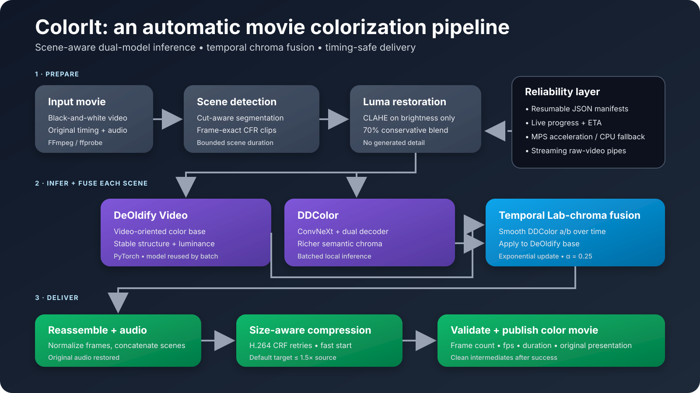

# ColorIt

**Give an old film a new life with one command.**

ColorIt is a local, automatic full-movie colorization pipeline for black-and-white films. Give it a movie, let it work scene by scene, and get back a compressed color movie with the original timing and audio preserved.

## Inspiration

I love watching old Kannada movies. Seeing the restored and colorized version of *Kasturi Nivasa* was a small revelation: familiar cinema suddenly felt more alive. The result was beautiful, but the restoration behind it was also intensive, expensive, and slow.

That led to a simple question: **could one person give an old film a credible second life in hours, on a computer they already own, instead of needing weeks of frame-by-frame work from a specialist team?** ColorIt is my attempt to make that possible with AI colorization models and practical video post-processing.

## The Problem

Old films preserve language, performance, fashion, music, and collective memory, but much of that history remains locked in aging black-and-white prints. Traditional colorization can require a skilled team, manual masks, repeated artistic decisions, and weeks of work. That cost puts it out of reach for individual viewers, small archives, and many rights holders.

Existing image colorizers also do not automatically become movie colorizers. A plausible frame is not enough: colors must remain stable over time, cuts must be handled cleanly, audio and timing must survive, and the result must remain practical to store and share.

## The Solution

ColorIt turns that process into a single local command. It detects scenes, gently restores luma contrast, runs two complementary AI colorizers, temporally smooths their chroma in Lab color space, reassembles the movie, restores the original audio, validates timing, and compresses the result to a size-aware target.

The goal is not to replace restoration artists. It is to put a useful first restoration pass within reach of anyone, and give experts a faster starting point.

## Target Users

- **Individual viewers and hobbyists** who want to color a film or personal clip themselves.
- **Film restoration experts** who want an automatic first pass before detailed artistic work.
- **Studios and rights holders** exploring faster, lower-cost restoration of back catalogs.

## Impact

ColorIt reduces a workflow that can take a specialist team several weeks to a few hours of unattended processing on powerful consumer hardware. A 2.5-hour film takes about six hours on an M3 Ultra Mac Studio; a CPU-only laptop can run the same pipeline more slowly without requiring a rented GPU.

The current system already makes skies, water, vegetation, mountains, and many skin tones feel natural enough to change the viewing experience. Costume color and difficult cross-cut consistency still need improvement, particularly during fast motion. Solving those remaining problems could help older films find new audiences instead of remaining archival objects.

The longer-term opportunity is broader than colorization. The same local, AI-assisted viewing layer can combine restoration, high-resolution detail reconstruction, subtitles, translation, and speech-aware lip synchronization. Streaming services and personal media tools could eventually adapt older content for new languages, displays, and audiences without requiring a separate manual production for every viewing context.

## Implemented Features

- **One-command, full-movie workflow** with automatic output naming and practical defaults.
- **Scene-aware processing** using FFmpeg scene-change detection and frame-exact clip boundaries.
- **Gentle luma restoration** using CLAHE on brightness only, improving contrast without inventing detail or shifting chroma.
- **Dual-model AI colorization** using DeOldify for a stable video-oriented base and DDColor for stronger semantic chroma.
- **Temporal chroma propagation** that smooths DDColor's Lab `a/b` channels over time before applying them to the DeOldify luminance base.
- **Streaming frame transport** through FFmpeg raw-video pipes instead of thousands of PNG round trips.
- **Efficient inference** through model reuse, DDColor batching, Apple Silicon MPS acceleration, and CPU fallback.
- **Resumable jobs** with scene and stage manifests, so successful work can survive interruptions.
- **Live progress and ETA** for frame processing, FFmpeg stages, and duration-weighted scene batches.
- **Original audio preservation** during final scene assembly.
- **Timing safety checks** covering frame count, frame rate, and duration before a run is accepted as complete.
- **Size-aware delivery** with H.264 compression retries targeting at most `1.5x` the input size by default.
- **Automatic cleanup** of intermediate clips and manifests after successful runs.

## Architecture



## How It Works

1. **Inspect and segment:** `ffprobe` reads the source dimensions, duration, frame rate, frame count, and audio metadata. FFmpeg scene-change detection divides the film at cuts; long scenes are bounded to manageable units.
2. **Prepare frame-exact clips:** the source is normalized to a constant-frame-rate mezzanine and split by frame counts so the movie can be reconstructed without drift.
3. **Restore contrast conservatively:** CLAHE is blended into the Lab luminance channel. This improves weak source contrast while preserving the original structure and avoiding generative restoration artifacts.
4. **Generate two color hypotheses:** DeOldify produces the stable video-oriented base; DDColor uses a ConvNeXt encoder and dual-decoder architecture to predict richer semantic color.
5. **Fuse color over time:** ColorIt keeps the DeOldify frame structure and smooths DDColor's Lab chroma using an exponential temporal update (`alpha = 0.25`). The smoothed chroma is then applied frame by frame.
6. **Reassemble and restore audio:** every processed scene is normalized to its expected frame count, concatenated in source order, and paired with the original audio.
7. **Compress and verify:** the pipeline retries progressively stronger H.264 compression when necessary, then verifies that output frame count, frame rate, and duration still match the source.

Manifests track each long-running stage. With `--resume`, already completed scenes can be reused after an interruption.

## Technology Stack

| Layer | Technology | Role |
|---|---|---|
| Language and packaging | Python 3.11, `uv` | Reproducible local installation and CLI |
| AI runtime | PyTorch, TorchVision | Model loading and inference |
| AI colorization | DeOldify Video, DDColor | Complementary frame color hypotheses |
| Image processing | OpenCV, NumPy, Pillow | CLAHE, Lab conversion, temporal chroma fusion, frame handling |
| Video processing | FFmpeg, `ffprobe` | Scene detection, decoding, encoding, audio, assembly, compression |
| Configuration and state | YAML, JSON manifests | Defaults, resumability, validation records |
| Acceleration | Apple Metal Performance Shaders; CPU fallback | Local inference without hosted GPU infrastructure |

ColorIt does not require an external API or database. Model weights are downloaded once and all movie processing happens locally.

## AI Innovation

Colorization is not ordinary automation: grayscale pixels do not contain the missing chroma, so the system must infer plausible color from learned visual semantics. ColorIt's innovation is in turning strong image-level inference into a practical movie system.

Rather than trusting one frame model, ColorIt combines the complementary behavior of two models and separates luminance from chroma. DeOldify supplies a stable structural base; DDColor supplies richer semantic color; a temporal Lab-chroma update reduces rapid frame-to-frame changes. Scene isolation, exact timing, resumption, audio preservation, and size-aware compression then make that AI output useful at movie scale.

This is deliberately an honest MVP: temporal smoothing improves continuity, but it does not understand that the same costume has returned after a cut. That limitation defines the next research step—models trained with temporal, actor-identity, and costume-identity context rather than additional hand-authored rules.

## How AI Assisted Development

OpenAI Codex was the primary AI development collaborator for ColorIt. The development loop was:

1. Define a visual or pipeline problem and the success criteria.
2. Use Codex to explore relevant research directions and narrow the search space.
3. Have Codex rapidly implement a focused prototype.
4. Inspect frames and videos, compare the result with the baseline, and decide whether to integrate, revise, or discard the idea.
5. Repeat until the simplest useful pipeline remained.

Codex accelerated research, implementation, debugging, and documentation; human review of actual video results controlled the product and technical decisions. At runtime, ColorIt uses DeOldify and DDColor locally and Codex is not part of movie inference.

## Requirements

- Python `>=3.11,<3.12`
- [`uv`](https://docs.astral.sh/uv/)
- `ffmpeg` and `ffprobe` on `PATH`
- A PyTorch-supported computer
- Enough free disk space for approximately 1.7 GB of model weights plus temporary video files

Apple Silicon MPS is used when available, with CPU fallback. Apple Silicon or a high-end desktop CPU completes movies much faster, but a normal laptop can run the included one-minute demonstration on CPU.

## Install

Install `uv` and FFmpeg using the package manager for your operating system. On macOS with Homebrew:

```bash
brew install uv ffmpeg
```

Then install ColorIt and fetch the model weights:

```bash
uv sync
uv run colorit download-weights
```

Weights are downloaded to `models/deoldify/ColorizeVideo_gen.pth` and `models/ddcolor/pytorch_model.bin`.

## Reproduce the Demo

The repository includes a one-minute excerpt from *Ramanjaneya Yuddha* (SRS Movies, `00:58:13–00:59:13`) as `demo.mp4`, together with the generated `demo_color.mp4` result.

Run the pipeline yourself:

```bash
uv run colorit colorize-movie \
  --input demo.mp4 \
  --output demo_recreated_color.mp4 \
  --overwrite
```

On a CPU-only laptop, allow approximately **60–90 minutes**, depending on the processor and available memory. For reference, the same class of workload takes roughly **2–3 minutes per source minute** on an M3 Ultra Mac Studio.

## Color Your Own Movie

```bash
uv run colorit colorize-movie --input /path/to/movie.mp4 --overwrite
```

Write to a specific path:

```bash
uv run colorit colorize-movie \
  --input /path/to/movie.mp4 \
  --output /path/to/movie_color.mp4 \
  --overwrite
```

Resume an interrupted run:

```bash
uv run colorit colorize-movie \
  --input /path/to/movie.mp4 \
  --output /path/to/movie_color.mp4 \
  --resume \
  --overwrite
```

By default, output is written next to the input with `_color` appended. The public CLI intentionally exposes only `download-weights` and `colorize-movie`; internal experimental flags are not part of the launch interface.

## MVP Scope

The MVP is an automatic pipeline that handles a wide variety of ordinary film scenes without masks, prompts, actor labels, or per-shot manual grading. It improves weak contrast conservatively, produces a usable color pass, preserves the source presentation, and keeps the final file practical.

It does not claim perfect historical color accuracy. Frame-to-frame consistency has improved, but difficult cuts, occlusion, fast action, actor identity, and costume continuity remain open problems.

## Validation

The included demonstration preserves all `1,500` source frames at `25 fps`, the 1080p resolution, the one-minute duration, and the audio track. See [the visual validation notes](docs/validation.md) for representative comparisons and an honest assessment of strengths and limitations.

## Future Roadmap

- **Temporally conditioned colorization:** train video models from scratch with multi-frame and cross-cut context, explicitly optimizing consistency rather than smoothing independent frame predictions after inference.
- **Actor and costume identity:** condition color decisions on recurring character identity, skin-tone stability, costume regions, and scene-level palettes so colors survive motion, occlusion, and editing.
- **Generative detail reconstruction for 1080p and 4K:** train temporally aware super-resolution models that reconstruct plausible high-frequency detail absent from the source instead of merely interpolating existing pixels. Temporal constraints and conservative confidence gating will be essential to avoid flicker and invented artifacts.
- **Multilingual viewing layer:** integrate ASR, time-aligned subtitles, translation, voice generation, and speech-aware lip synchronization to make older cinema accessible across languages.
- **Expert controls:** add optional reference palettes and review checkpoints while preserving the one-command default for individual users.

## Current Limits

- Costume colors can be conservative or implausible.
- The same costume can still shift across difficult cuts.
- Heavy occlusion, fast motion, dances, and fights remain challenging.
- The temporal filter can briefly carry chroma across a hard visual transition.
- Poor contrast or damaged transfers can still produce weak color.
- Results are plausible AI interpretations, not verified records of the original production colors.

## License and Third-Party Components

ColorIt is released under the [ColorIt Attribution License 1.0](LICENSE). If you publicly share output, include a credit such as `Colorized with ColorIt`.

DeOldify, DDColor, FFmpeg, PyTorch, OpenCV, and other dependencies retain their own licenses. See [THIRD_PARTY_NOTICES.md](THIRD_PARTY_NOTICES.md) for sources, roles, and license references.

The ColorIt license does not grant rights to an input movie. Users are responsible for obtaining the rights required to copy, modify, colorize, or distribute their source media.
