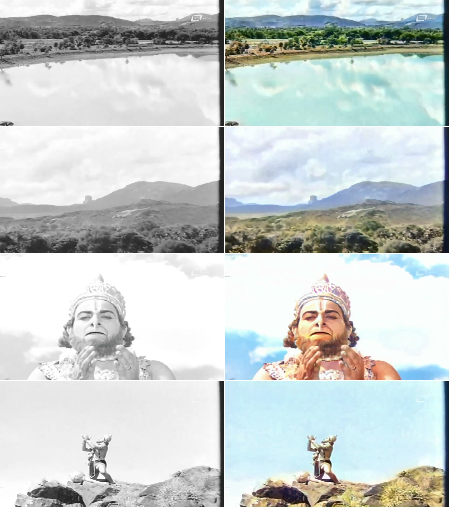

# Demo Validation

The included validation pair uses a one-minute excerpt from the SRS Movies presentation of *Ramanjaneya Yuddha*, covering approximately `00:58:13–00:59:13`:

- [`demo.mp4`](../demo.mp4): black-and-white source
- [`demo_color.mp4`](../demo_color.mp4): ColorIt output

## Side-by-Side Comparison

In every row below, the **original frame is on the left** and the matching **ColorIt frame is on the right**.



| Row | Clip time | What the comparison shows |
|---:|---:|---|
| 1 | `00:24` | **Sky and water:** the model assigns distinct blue/cyan tones while preserving cloud reflections and the shoreline. Trees separate into readable greens and earth tones. This is the strongest result in the clip. |
| 2 | `00:35` | **Forest and mountain:** vegetation gains a coherent green palette, the foreground remains distinct, and the mountain stays appropriately muted rather than becoming oversaturated. |
| 3 | `00:30` | **Actor:** the face and hands receive a plausible, reasonably consistent skin tone. Facial structure and the source's highlights remain intact, although the bright transfer limits subtle shading. |
| 4 | `00:15` | **Costume:** ColorIt recognizes the actor, crown, clothing, rocks, and sky as different semantic regions and makes a credible attempt. The costume palette is still subdued and lacks the confident, vivid art direction expected from a finished restoration. |

## Technical Evidence

The media was inspected by decoding and counting frames with `ffprobe`, rather than relying only on container metadata.

| Property | Source | ColorIt output | Result |
|---|---:|---:|---|
| Resolution | 1920 × 1080 | 1920 × 1080 | Preserved |
| Frame rate | 25 fps | 25 fps | Preserved |
| Decoded video frames | 1,500 | 1,500 | Preserved |
| Container duration | 60.001 s | 60.010 s | 0.009 s difference |
| Audio | Opus, 48 kHz stereo | AAC, 48 kHz stereo | Track preserved and delivery-normalized |
| File size | 8,397,530 bytes | 16,553,415 bytes | 1.97× source |
| Video codec | AV1 | H.264 | Broad playback compatibility |

The sample stays just under the project's 2× size ceiling. It does not meet the current 1.5× launch target because the small source is already efficiently compressed with AV1 while the delivery file uses broadly compatible H.264. The pipeline reports when a configured size target cannot be reached after its compression retries instead of silently claiming success.

## Qualitative Result

### What works well

- Natural scene categories are recognized reliably: blue sky, reflective water, green vegetation, brown rock, and muted distant terrain.
- Large regions remain visually coherent within a shot instead of changing color on every frame.
- The actor's skin is plausible and does not take on the strong green/cyan bias seen in discarded prototype approaches.
- Luma structure, framing, motion, frame rate, duration, and audio remain faithful to the source.

### What still needs work

- Costume colors remain less vivid and decisive than the environments.
- Independent frame models do not know that a character or costume seen after a cut is the same identity as before it.
- Fast motion, occlusion, and abrupt composition changes can expose temporal carry-over or weak semantic predictions.
- The output is a plausible interpretation, not a claim about historically accurate production colors.

These limitations motivate the roadmap toward a temporally conditioned video model with actor, skin-tone, costume, and scene-palette identity built into training.

## Reproduce It

After installing dependencies and downloading weights as described in the main README:

```bash
uv run colorit colorize-movie \
  --input demo.mp4 \
  --output demo_recreated_color.mp4 \
  --overwrite
```

Allow approximately 60–90 minutes on a CPU-only laptop, depending on the hardware. The expected result is represented by `demo_color.mp4`; codec-level byte equality is not expected across platforms.

## Comparison Method

The grid uses exact matching timestamps from the source and output (`00:24`, `00:35`, `00:30`, and `00:15`). Frames were scaled equally and placed side by side without color correction, retouching, or selective masking after ColorIt completed.
